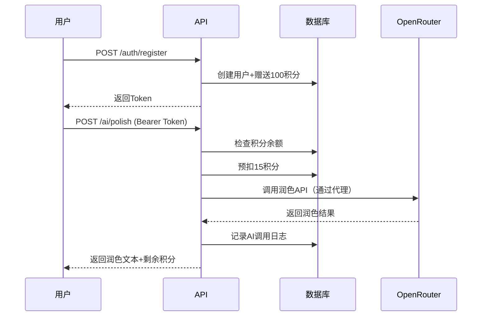
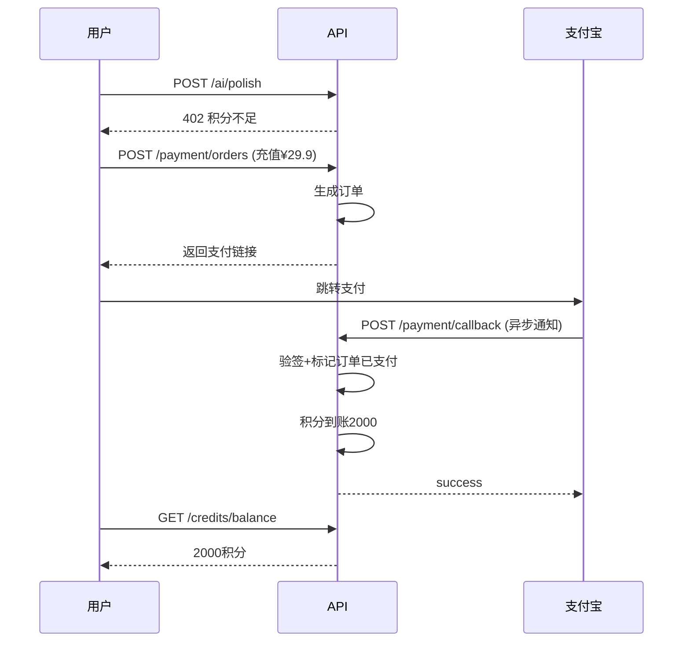

# API接口文档

## 📚 文档说明

本项目使用OpenAPI 3.0规范定义接口，支持自动生成文档和客户端代码。

---

## 🚀 快速开始

### 1. 在线查看文档

**方式A: Swagger UI（本地）**
```bash
# 安装swagger-ui
npm install -g swagger-ui-watcher

# 启动文档服务
swagger-ui-watcher api/openapi.yaml
# 访问 http://localhost:8080
```

**方式B: Apifox（推荐）**
1. 下载 [Apifox](https://www.apifox.cn/)
2. 导入 `api/openapi.yaml`
3. 自动生成Mock服务器

**方式C: Redoc**
```bash
npx @redocly/cli preview-docs api/openapi.yaml
```

---

### 2. 导入Apifox

#### 步骤：
1. 打开Apifox → 新建项目
2. 点击"数据管理" → "导入数据"
3. 选择"OpenAPI/Swagger" → 上传 `api/openapi.yaml`
4. 导入后自动生成：
   - ✅ 完整接口列表
   - ✅ 请求/响应示例
   - ✅ Mock服务器
   - ✅ 测试用例

#### Apifox环境配置

**本地开发环境**:
```json
{
  "baseUrl": "http://localhost:3000/api",
  "token": "Bearer eyJhbGc...",
  "proxy": "http://127.0.0.1:7890"
}
```

**生产环境**:
```json
{
  "baseUrl": "https://api.yourapp.com/api",
  "token": "Bearer xxx"
}
```

---

## 📋 接口清单

### 认证模块（3个）
| 接口 | 方法 | 路径 | 说明 |
|------|------|------|------|
| 注册 | POST | /auth/register | 赠送100积分 |
| 登录 | POST | /auth/login | 返回JWT Token |
| 刷新Token | POST | /auth/refresh | 刷新访问令牌 |

### 积分模块（2个）
| 接口 | 方法 | 路径 | 说明 |
|------|------|------|------|
| 查询余额 | GET | /credits/balance | 当前积分 |
| 流水记录 | GET | /credits/transactions | 分页查询 |

### 论文模块（5个）
| 接口 | 方法 | 路径 | 说明 |
|------|------|------|------|
| 论文列表 | GET | /papers | 支持标签筛选 |
| 创建论文 | POST | /papers | - |
| 论文详情 | GET | /papers/:id | - |
| 更新论文 | PATCH | /papers/:id | - |
| 删除论文 | DELETE | /papers/:id | 软删除 |

### AI服务模块（5个）
| 接口 | 方法 | 路径 | 说明 | 积分消耗 |
|------|------|------|------|----------|
| 段落润色 | POST | /ai/polish | 语法/逻辑/文风 | 15积分 |
| 生成大纲 | POST | /ai/generate-outline | - | 10积分 |
| 语法检查 | POST | /ai/check-grammar | - | 20积分 |
| 生成文献 | POST | /ai/generate-references | - | 10积分 |
| 降重改写 | POST | /ai/rewrite | - | 50积分 |

### 支付模块（3个）
| 接口 | 方法 | 路径 | 说明 |
|------|------|------|------|
| 创建订单 | POST | /payment/orders | 支付宝支付 |
| 查询订单 | GET | /payment/orders/:id | - |
| 支付回调 | POST | /payment/callback/alipay | 异步通知 |

### 运营模块（3个）
| 接口 | 方法 | 路径 | 说明 | 奖励 |
|------|------|------|------|------|
| 每日签到 | POST | /user/checkin | - | +5积分 |
| 生成邀请码 | GET | /user/invite-code | - | - |
| 使用邀请码 | POST | /user/redeem-invite | - | +50积分 |

**总计**: 21个核心接口

---

## 🔑 认证流程

### 1. 注册/登录获取Token

```bash
# 注册
curl -X POST http://localhost:3000/api/auth/register \
  -H "Content-Type: application/json" \
  -d '{
    "email": "test@example.com",
    "password": "Pass123!"
  }'

# 响应
{
  "success": true,
  "data": {
    "user": {
      "id": "uuid",
      "email": "test@example.com",
      "credits": 100
    },
    "tokens": {
      "access_token": "eyJhbGc...",
      "refresh_token": "eyJhbGc...",
      "expires_in": 604800
    }
  }
}
```

### 2. 使用Token调用接口

```bash
# 所有需要认证的接口添加Authorization头
curl -X GET http://localhost:3000/api/credits/balance \
  -H "Authorization: Bearer eyJhbGc..."
```

### 3. Token刷新

```bash
curl -X POST http://localhost:3000/api/auth/refresh \
  -H "Content-Type: application/json" \
  -d '{
    "refresh_token": "eyJhbGc..."
  }'
```

---

## 💡 典型业务流程

### 流程1: 用户注册 → 使用AI润色



### 流程2: 积分不足 → 充值



---

## 🧪 测试用例

### 测试1: 注册新用户

**请求**:
```http
POST /api/auth/register
Content-Type: application/json

{
  "email": "test@test.com",
  "password": "Test123!"
}
```

**预期响应**:
```json
{
  "success": true,
  "data": {
    "user": {
      "credits": 100
    },
    "tokens": {
      "access_token": "xxx"
    }
  }
}
```

**验证点**:
- ✅ 返回JWT Token
- ✅ 用户获得100初始积分
- ✅ 积分流水表有记录

---

### 测试2: AI润色（正常流程）

**前置条件**:
- 已登录，积分≥15

**请求**:
```http
POST /api/ai/polish
Authorization: Bearer <token>
Content-Type: application/json

{
  "text": "本文探讨了AI在教育的应用",
  "type": "grammar"
}
```

**预期响应**:
```json
{
  "success": true,
  "data": {
    "original": "本文探讨了AI在教育的应用",
    "polished": "本研究系统分析了AI在教育领域的应用",
    "changes": [
      {
        "type": "grammar",
        "position": [0, 10],
        "suggestion": "学术用语建议使用'研究'代替'探讨'"
      }
    ],
    "credits_cost": 15,
    "credits_remaining": 85
  }
}
```

**验证点**:
- ✅ 扣除15积分
- ✅ 积分流水表有消费记录
- ✅ AI调用日志表有记录

---

### 测试3: AI润色（积分不足）

**前置条件**:
- 已登录，积分<15

**请求**:
```http
POST /api/ai/polish
Authorization: Bearer <token>
Content-Type: application/json

{
  "text": "测试文本",
  "type": "grammar"
}
```

**预期响应**:
```json
{
  "success": false,
  "error": {
    "code": "INSUFFICIENT_CREDITS",
    "message": "积分不足，请充值",
    "details": {
      "required": 15,
      "current": 5
    }
  }
}
```

**HTTP状态码**: `402`

---

### 测试4: 并发扣费（防超卖）

**场景**:
- 用户剩余20积分
- 同时发起3个润色请求（每个15积分）

**预期结果**:
- ✅ 第1个请求成功，剩余5积分
- ❌ 第2、3个请求失败（积分不足）
- ✅ 数据库积分余额=5（不出现负数）

**验证SQL**:
```sql
-- 检查积分余额
SELECT credits FROM users WHERE id = 'xxx';
-- 应为5，不是-25

-- 检查流水表
SELECT COUNT(*) FROM credit_transactions
WHERE user_id = 'xxx' AND type = 'consume';
-- 应为1条，不是3条
```

---

## 🔧 Mock服务器

### 使用Apifox Mock

1. Apifox导入后自动生成Mock
2. Mock地址: `https://mock.apifox.cn/xxx`
3. 前端可直接对接Mock开发

### Mock数据示例

**GET /credits/balance**
```json
{
  "success": true,
  "data": {
    "credits": 285,
    "is_vip": false
  }
}
```

**POST /ai/polish**
```json
{
  "success": true,
  "data": {
    "original": "{{@string}}",
    "polished": "{{@paragraph}}",
    "credits_cost": 15,
    "credits_remaining": "{{@integer(100, 500)}}"
  }
}
```

---

## 📦 生成客户端代码

### 前端TypeScript SDK

```bash
# 安装openapi-generator
npm install -g @openapitools/openapi-generator-cli

# 生成TypeScript Axios客户端
openapi-generator-cli generate \
  -i api/openapi.yaml \
  -g typescript-axios \
  -o frontend/src/api/generated

# 使用
import { AuthApi, AIApi } from '@/api/generated'

const authApi = new AuthApi()
const response = await authApi.authLoginPost({
  email: 'test@test.com',
  password: 'xxx'
})
```

### 后端NestJS代码生成

```bash
# 生成DTO类
npx @nestjs/swagger-codegen \
  --spec api/openapi.yaml \
  --output backend/src/generated
```

---

## 🐛 常见问题

### Q1: 如何调试代理配置？

**A**: 在Apifox中配置代理
```
设置 → 代理设置 → HTTP代理
地址: 127.0.0.1:7890
```

### Q2: Token过期怎么办？

**A**: 使用refresh_token刷新
```javascript
// axios拦截器自动刷新
axios.interceptors.response.use(
  response => response,
  async error => {
    if (error.response?.status === 401) {
      const newToken = await refreshToken()
      error.config.headers.Authorization = `Bearer ${newToken}`
      return axios.request(error.config)
    }
  }
)
```

### Q3: 如何测试支付回调？

**A**: 使用内网穿透
```bash
# 方式1: ngrok
ngrok http 3000
# 将公网URL配置到支付宝后台

# 方式2: Apifox Mock
# 直接用Mock地址测试前端逻辑
```

---

## 📊 接口性能要求

| 接口类型 | 响应时间 | 说明 |
|---------|---------|------|
| 查询类接口 | <200ms | 如查询余额、论文列表 |
| AI调用接口 | <5s | OpenRouter API响应时间 |
| 支付类接口| <1s | 创建订单 |
| 回调接口 | <500ms | 支付宝回调 |

---

## 🔒 安全规范

### 1. 参数校验
- ✅ 所有输入必须校验
- ✅ 文本长度限制（防攻击）
- ✅ 邮箱格式验证

### 2. 敏感信息
- ❌ 不返回密码hash
- ❌ 不返回完整手机号（中间脱敏）
- ❌ 错误信息不泄露系统细节

### 3. 频率限制
```yaml
# 接口限流规则
/auth/register: 3次/小时/IP
/auth/login: 10次/小时/IP
/ai/*: 30次/分钟/用户
```

---

## 📝 更新日志

### v1.0.0 (2025-01-XX)
- ✅ 完成OpenAPI 3.0规范定义
- ✅ 21个核心接口
- ✅ 支持Swagger/Apifox导入
- ✅ 完整Mock数据

---

## 🔗 相关链接

- [OpenAPI规范](https://spec.openapis.org/oas/v3.0.3)
- [Apifox官网](https://www.apifox.cn/)
- [Swagger UI](https://swagger.io/tools/swagger-ui/)
- [项目文档](../docs/)
