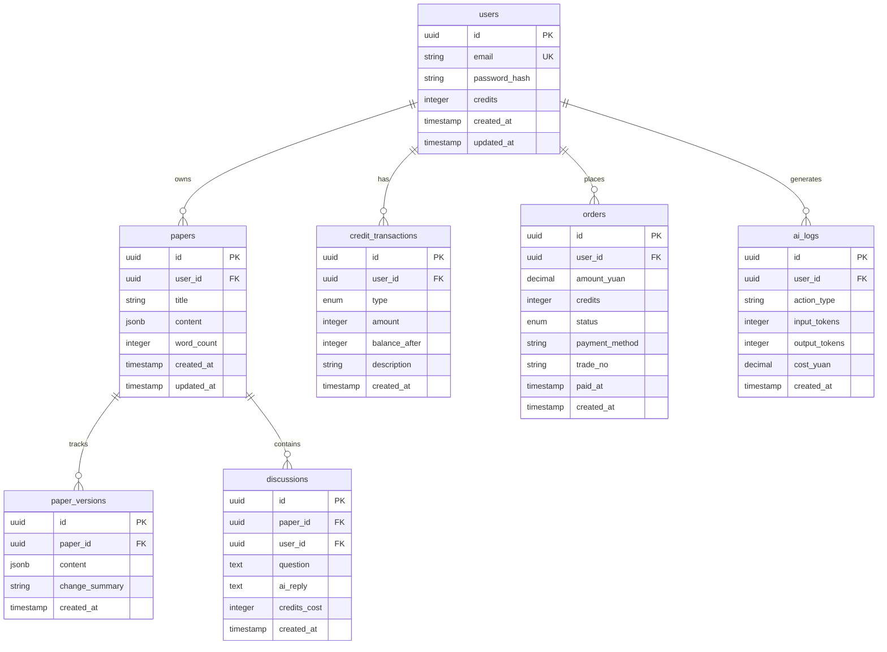

# 数据库设计

## 📊 ER图



---

## 📋 表结构详细设计

### 1. users（用户表）

```sql
CREATE TABLE users (
  id UUID PRIMARY KEY DEFAULT gen_random_uuid(),
  email VARCHAR(255) UNIQUE NOT NULL,
  password_hash VARCHAR(255) NOT NULL,
  credits INTEGER DEFAULT 100 NOT NULL, -- 积分余额
  phone VARCHAR(20), -- 手机号（可选）
  avatar_url TEXT,
  is_vip BOOLEAN DEFAULT FALSE, -- VIP标识
  vip_expires_at TIMESTAMP, -- VIP过期时间
  created_at TIMESTAMP DEFAULT NOW(),
  updated_at TIMESTAMP DEFAULT NOW()
);

-- 索引
CREATE INDEX idx_users_email ON users(email);
CREATE INDEX idx_users_created_at ON users(created_at);

-- 触发器：自动更新updated_at
CREATE TRIGGER update_users_updated_at
  BEFORE UPDATE ON users
  FOR EACH ROW
  EXECUTE FUNCTION update_updated_at_column();
```

**字段说明**:
- `credits`: 实时余额，高频读取（需Redis缓存）
- `is_vip`: 充值¥99自动设置为true

---

### 2. credit_transactions（积分流水表）

```sql
CREATE TABLE credit_transactions (
  id UUID PRIMARY KEY DEFAULT gen_random_uuid(),
  user_id UUID NOT NULL REFERENCES users(id) ON DELETE CASCADE,
  type VARCHAR(20) NOT NULL, -- 'recharge'充值 / 'consume'消耗 / 'reward'奖励 / 'refund'退款
  amount INTEGER NOT NULL, -- 正数为增加，负数为减少
  balance_after INTEGER NOT NULL, -- 操作后的余额（便于对账）
  description TEXT, -- 描述：如"段落润色"、"充值¥29.9"
  reference_id UUID, -- 关联ID（如订单ID、AI日志ID）
  created_at TIMESTAMP DEFAULT NOW()
);

-- 索引
CREATE INDEX idx_credit_trans_user_id ON credit_transactions(user_id);
CREATE INDEX idx_credit_trans_created_at ON credit_transactions(created_at DESC);
CREATE INDEX idx_credit_trans_type ON credit_transactions(type);
```

**关键约束**:
- 每次积分变动必须记录
- `balance_after`用于对账验证
- 禁止UPDATE/DELETE（只允许INSERT）

**对账逻辑**:
```sql
-- 每小时执行
SELECT user_id,
       SUM(amount) as total_change,
       LAST_VALUE(balance_after) as expected_balance
FROM credit_transactions
WHERE created_at > NOW() - INTERVAL '1 hour'
GROUP BY user_id;

-- 对比users表的credits字段
```

---

### 3. papers（论文表）

```sql
CREATE TABLE papers (
  id UUID PRIMARY KEY DEFAULT gen_random_uuid(),
  user_id UUID NOT NULL REFERENCES users(id) ON DELETE CASCADE,
  title VARCHAR(500) DEFAULT '无标题论文',
  content JSONB NOT NULL, -- Tiptap JSON格式
  word_count INTEGER DEFAULT 0,
  tags VARCHAR(50)[], -- 标签数组：如['毕业论文', 'AI伦理']
  is_deleted BOOLEAN DEFAULT FALSE, -- 软删除
  created_at TIMESTAMP DEFAULT NOW(),
  updated_at TIMESTAMP DEFAULT NOW()
);

-- 索引
CREATE INDEX idx_papers_user_id ON papers(user_id);
CREATE INDEX idx_papers_updated_at ON papers(updated_at DESC);
CREATE INDEX idx_papers_tags ON papers USING GIN(tags); -- GIN索引支持数组查询
```

**JSONB内容示例**:
```json
{
  "type": "doc",
  "content": [
    {
      "type": "heading",
      "attrs": { "level": 1 },
      "content": [{ "type": "text", "text": "引言" }]
    },
    {
      "type": "paragraph",
      "content": [{ "type": "text", "text": "本文探讨..." }]
    }
  ]
}
```

**字数统计触发器**:
```sql
CREATE OR REPLACE FUNCTION update_word_count()
RETURNS TRIGGER AS $$
BEGIN
  NEW.word_count := (
    SELECT SUM(LENGTH(elem->>'text'))
    FROM jsonb_array_elements(NEW.content->'content') AS elem
  );
  RETURN NEW;
END;
$$ LANGUAGE plpgsql;

CREATE TRIGGER calculate_word_count
  BEFORE INSERT OR UPDATE ON papers
  FOR EACH ROW
  EXECUTE FUNCTION update_word_count();
```

---

### 4. paper_versions（版本历史表）

```sql
CREATE TABLE paper_versions (
  id UUID PRIMARY KEY DEFAULT gen_random_uuid(),
  paper_id UUID NOT NULL REFERENCES papers(id) ON DELETE CASCADE,
  content JSONB NOT NULL,
  change_summary TEXT, -- AI生成的修改总结
  created_at TIMESTAMP DEFAULT NOW()
);

-- 索引
CREATE INDEX idx_versions_paper_id ON paper_versions(paper_id);
CREATE INDEX idx_versions_created_at ON paper_versions(created_at DESC);

-- 限制每篇论文最多保存20个版本（防止存储爆炸）
CREATE OR REPLACE FUNCTION limit_versions()
RETURNS TRIGGER AS $$
BEGIN
  DELETE FROM paper_versions
  WHERE paper_id = NEW.paper_id
    AND id NOT IN (
      SELECT id FROM paper_versions
      WHERE paper_id = NEW.paper_id
      ORDER BY created_at DESC
      LIMIT 20
    );
  RETURN NEW;
END;
$$ LANGUAGE plpgsql;

CREATE TRIGGER enforce_version_limit
  AFTER INSERT ON paper_versions
  FOR EACH ROW
  EXECUTE FUNCTION limit_versions();
```

---

### 5. discussions（讨论表）

```sql
CREATE TABLE discussions (
  id UUID PRIMARY KEY DEFAULT gen_random_uuid(),
  paper_id UUID NOT NULL REFERENCES papers(id) ON DELETE CASCADE,
  user_id UUID NOT NULL REFERENCES users(id) ON DELETE CASCADE,
  question TEXT NOT NULL, -- 用户提问
  context_text TEXT, -- 提问时选中的段落
  ai_reply TEXT, -- AI回复
  credits_cost INTEGER DEFAULT 20, -- 本次消耗积分
  created_at TIMESTAMP DEFAULT NOW()
);

-- 索引
CREATE INDEX idx_discussions_paper_id ON discussions(paper_id);
CREATE INDEX idx_discussions_created_at ON discussions(created_at DESC);
```

---

### 6. orders（订单表）

```sql
CREATE TABLE orders (
  id UUID PRIMARY KEY DEFAULT gen_random_uuid(),
  user_id UUID NOT NULL REFERENCES users(id) ON DELETE CASCADE,
  amount_yuan DECIMAL(10,2) NOT NULL, -- 支付金额
  credits INTEGER NOT NULL, -- 充值积分数
  status VARCHAR(20) DEFAULT 'pending', -- 'pending'待支付 / 'paid'已支付 / 'failed'失败 / 'refunded'已退款
  payment_method VARCHAR(50), -- 'alipay' / 'wechat'
  trade_no VARCHAR(100) UNIQUE, -- 支付宝/微信交易号
  paid_at TIMESTAMP, -- 支付完成时间
  created_at TIMESTAMP DEFAULT NOW()
);

-- 索引
CREATE INDEX idx_orders_user_id ON orders(user_id);
CREATE INDEX idx_orders_status ON orders(status);
CREATE INDEX idx_orders_trade_no ON orders(trade_no);
CREATE INDEX idx_orders_created_at ON orders(created_at DESC);
```

**状态流转**:
```
pending → paid → (触发积分到账)
pending → failed (超时未支付)
paid → refunded (用户申请退款)
```

---

### 7. ai_logs（AI调用日志表）

```sql
CREATE TABLE ai_logs (
  id UUID PRIMARY KEY DEFAULT gen_random_uuid(),
  user_id UUID NOT NULL REFERENCES users(id) ON DELETE CASCADE,
  action_type VARCHAR(50) NOT NULL, -- 'polish_grammar' / 'generate_outline' / 'check_logic'
  input_text TEXT, -- 输入内容（脱敏后存储）
  output_text TEXT, -- AI返回内容
  input_tokens INTEGER,
  output_tokens INTEGER,
  cost_yuan DECIMAL(10,4), -- 本次调用成本
  duration_ms INTEGER, -- 响应耗时
  error_message TEXT, -- 错误信息（如有）
  created_at TIMESTAMP DEFAULT NOW()
);

-- 索引
CREATE INDEX idx_ai_logs_user_id ON ai_logs(user_id);
CREATE INDEX idx_ai_logs_action_type ON ai_logs(action_type);
CREATE INDEX idx_ai_logs_created_at ON ai_logs(created_at DESC);

-- 分区表（按月分区，便于清理旧数据）
CREATE TABLE ai_logs_2025_01 PARTITION OF ai_logs
  FOR VALUES FROM ('2025-01-01') TO ('2025-02-01');
```

**用途**:
- 成本分析：每个功能的LLM成本占比
- 用户行为分析：最常用的功能
- 异常监控：error_message不为空的记录

---

## 🔧 Redis缓存设计

### Key设计规范

```
user:credits:{user_id}         → 用户积分余额（TTL 300秒）
ai:cache:{md5(text+type)}      → AI调用结果缓存（TTL 86400秒）
lock:credits:{user_id}         → 积分扣费分布式锁（TTL 10秒）
ratelimit:ai:{user_id}         → 接口限流计数（TTL 60秒）
session:{token}                → 用户会话（JWT黑名单）
```

### 缓存策略

**1. 积分余额缓存**:
```typescript
// 读取时
const cached = await redis.get(`user:credits:${userId}`)
if (cached) return parseInt(cached)

const credits = await db.users.findOne({ id: userId }).credits
await redis.setex(`user:credits:${userId}`, 300, credits)
return credits

// 扣费时
await redis.del(`user:credits:${userId}`) // 删除缓存，下次重新读取
```

**2. AI结果缓存**:
```typescript
const cacheKey = `ai:cache:${md5(text + actionType)}`
const cached = await redis.get(cacheKey)
if (cached) {
  return JSON.parse(cached) // 节省LLM成本
}

const result = await callLLM(text)
await redis.setex(cacheKey, 86400, JSON.stringify(result))
```

---

## 🛡️ 数据安全

### 1. 敏感字段加密

```typescript
// 论文内容加密存储（可选）
import { createCipheriv, createDecipheriv } from 'crypto'

function encrypt(text: string): string {
  const cipher = createCipheriv('aes-256-gcm', key, iv)
  return cipher.update(text, 'utf8', 'hex') + cipher.final('hex')
}
```

### 2. 备份策略

```bash
# PostgreSQL每日全量备份
0 3 * * * pg_dump -U postgres paper_db | gzip > /backup/$(date +\%Y\%m\%d).sql.gz

# 保留最近30天
find /backup -name "*.sql.gz" -mtime +30 -delete
```

### 3. 软删除

```sql
-- 论文不真正删除，只标记
UPDATE papers SET is_deleted = TRUE WHERE id = $1;

-- 查询时过滤
SELECT * FROM papers WHERE user_id = $1 AND is_deleted = FALSE;
```

---

## 📈 性能优化

### 1. 索引优化

```sql
-- 分析慢查询
EXPLAIN ANALYZE
SELECT * FROM papers
WHERE user_id = 'xxx'
ORDER BY updated_at DESC
LIMIT 10;

-- 复合索引
CREATE INDEX idx_papers_user_updated
ON papers(user_id, updated_at DESC);
```

### 2. 连接池配置

```typescript
// TypeORM配置
{
  type: 'postgres',
  host: 'localhost',
  port: 5432,
  poolSize: 20, // 连接池大小
  extra: {
    max: 20,
    idleTimeoutMillis: 30000,
    connectionTimeoutMillis: 2000
  }
}
```

### 3. 分页优化

```sql
-- 避免OFFSET大数值查询
-- ❌ 慢查询
SELECT * FROM papers ORDER BY created_at DESC OFFSET 10000 LIMIT 10;

-- ✅ 游标分页
SELECT * FROM papers
WHERE created_at < $1 -- 上一页最后一条的created_at
ORDER BY created_at DESC
LIMIT 10;
```

---

## 🔍 数据统计SQL

### 用户增长
```sql
SELECT DATE(created_at) as date, COUNT(*) as new_users
FROM users
WHERE created_at > NOW() - INTERVAL '30 days'
GROUP BY DATE(created_at)
ORDER BY date;
```

### 付费转化率
```sql
SELECT
  (SELECT COUNT(DISTINCT user_id) FROM orders WHERE status = 'paid') * 100.0 /
  (SELECT COUNT(*) FROM users)
  AS conversion_rate;
```

### LLM成本统计
```sql
SELECT
  action_type,
  COUNT(*) as call_count,
  SUM(cost_yuan) as total_cost,
  AVG(duration_ms) as avg_duration
FROM ai_logs
WHERE created_at > NOW() - INTERVAL '7 days'
GROUP BY action_type
ORDER BY total_cost DESC;
```
